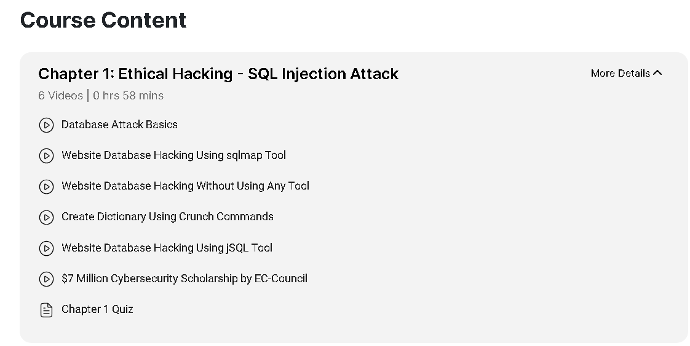
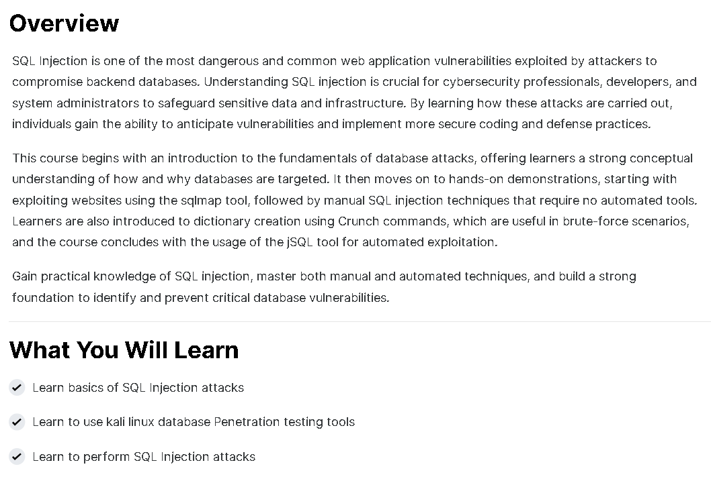

# 🛡️ SQL Injection Attacks – EC-Council Course Archive

This repository documents my learning and practical exercises from the **"SQL Injection Attacks"** course by [EC-Council](https://www.eccouncil.org/). It includes course notes, simulated attack demonstrations, screenshots, certificate, and practical labs related to exploiting and mitigating SQL Injection vulnerabilities.

---

## 📜 Certificate

- 🎓 [SQL Injection Attacks Certificate](./cert/SQL%20Injection%20Attacks.png)

---

## 📒 Topics Covered

- 🔍 Introduction to SQL Injection
- 🚪 Authentication bypass
- 📊 UNION-based injection for data extraction
- 🧱 Error-based and blind SQLi
- 🧬 Advanced SQLi with stacked queries
- 🛡️ Defense strategies and secure query handling

---

## 📂 Structure

| Folder         | Description                                      |
|----------------|--------------------------------------------------|
| `notes/`       | Conceptual breakdowns and topic summaries        |
| `demo/`        | Hands-on practical attack demonstrations         |
| `screenshots/` | Visuals from course content and proof-of-practice|
| `cert/`        | Course certificate                               |
| `LICENSE`      | License file (MIT)                               |
| `DISCLAIMER.md`| Ethical use and disclaimer policy                |
| `CODE_OF_CONDUCT.md` | Contributor conduct and project guidelines |

---

## 📘 Notes

- [`sqli-introduction.md`](./notes/sqli-introduction.md)
- [`sqli-auth-bypass.md`](./notes/sqli-auth-bypass.md)
- [`union-based-injection.md`](./notes/union-based-injection.md)
- [`defense-strategies-sqli.md`](./notes/defense-strategies-sqli.md)

---

## 💻 Demo

- [`Authentication Bypass via Classic SQL Injection.md`](./demo/Authentication%20Bypass%20via%20Classic%20SQL%20Injection.md)
- [`Error-Based SQLi for Database Fingerprinting.md`](./demo/Error-Based%20SQLi%20for%20Database%20Fingerprinting.md)
- [`Time-Based Blind SQL Injection.md`](./demo/Time-Based%20Blind%20SQL%20Injection.md)
- [`UNION-Based Injection for Data Extraction.md`](./demo/UNION-Based%20Injection%20for%20Data%20Extraction.md)
- [`Stacked Queries for Remote Shell Upload (PostgreSQL).md`](./demo/Stacked%20Queries%20for%20Remote%20Shell%20Upload%20(PostgreSQL).md)

---

## 📸 Screenshots

| Description          | Screenshot |
|----------------------|------------|
| 📘 Course Content     |  |
| 📑 Course Overview    |  |

---

## 📝 Course Review

This course provides a hands-on and technical overview of SQL Injection attacks from basic to advanced levels. Ideal for web app pentesters, bug bounty hunters, and developers interested in defensive coding.

✅ **What I liked**:
- Deep dive into multiple types of SQLi
- PostgreSQL stack-based examples
- Real-world exploitation scenarios

📌 **Suggestions**:
- Include labs with public test environments
- Add modules on WAF bypasses and evasion

---

## ❗ Disclaimer

This repository is created for **educational and ethical** research only.

By using any resource from this project, you agree to:

- ❌ Never test against systems you do not own or lack permission for
- ⚖️ Accept full legal responsibility for your actions
- 📚 Use all demos strictly in controlled lab environments

See [`DISCLAIMER.md`](./DISCLAIMER.md) for full policy.

---

## ✍️ Author

**Thành Danh** – Pentester & Cybersecurity Research  

GitHub: [@ngvtdanhh](https://github.com/ngvtdanhh)  

Email: ngvu.thdanh@gmail.com

---

## 📄 License

This project is licensed under the **MIT License**.  
See [`LICENSE`](./LICENSE) for full details.

© 2025 ngvtdanhh. All rights reserved.
